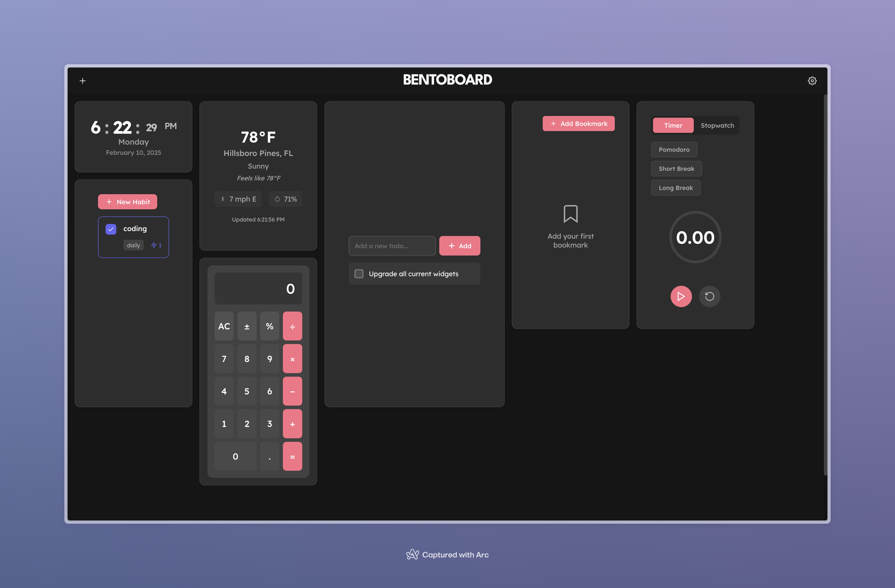

# BentoBoard 🍱

A modern, customizable dashboard application built with React that allows users to create their perfect productivity workspace with draggable and resizable widgets.



## ✨ Features

- 🎯 **Customizable Dashboard**: Drag-and-drop interface with resizable widgets
- 🎨 **Modern UI**: Clean, minimal design with smooth animations and transitions
- 💾 **Persistent State**: All widget positions, sizes, and data are automatically saved
- 🌓 **Theme Support**: Built-in dark mode with customizable accent colors
- 📱 **Responsive Design**: Adapts to different screen sizes

### Available Widgets
- ⏰ Clock with multiple display modes
- ✅ Todo list with drag-and-drop reordering
- 🌤️ Weather information with location support
- 📝 Notes with rich text editing
- 🔢 Calculator with standard operations
- ⏱️ Timer with countdown and stopwatch modes
- 📊 Habit tracker for daily/weekly habits
- 🔖 Bookmarks for quick access to links

## 🚀 Quick Start

### Prerequisites

- Node.js (v14 or higher)
- npm or yarn

### Installation

1. Clone the repository:
```bash
git clone https://github.com/jsap7/desktop-app.git
cd bentoboard
```

2. Install dependencies:
```bash
npm install
# or
yarn install
```

3. Start the development server:
```bash
npm start
# or
yarn start
```

The application will be available at [http://localhost:3000](http://localhost:3000).

## 📖 Documentation

For detailed documentation about:
- Widget development
- Theme customization
- Contributing guidelines
- API reference

Visit our [Documentation](docs/README.md).

## 🤝 Contributing

We love your input! Check out our [Contributing Guidelines](CONTRIBUTING.md) for ways to contribute.

Please note that this project is released with a [Code of Conduct](CODE_OF_CONDUCT.md). By participating in this project you agree to abide by its terms.

## 📜 License

BentoBoard is licensed under the GNU General Public License v3.0 - see the [LICENSE](LICENSE) file for details.

## 🐛 Known Issues

See our [Issues](https://github.com/jsap7/desktop-app/issues) page for a list of known issues and planned improvements.

## 💬 Community

- [GitHub Discussions](https://github.com/jsap7/desktop-app/discussions)


